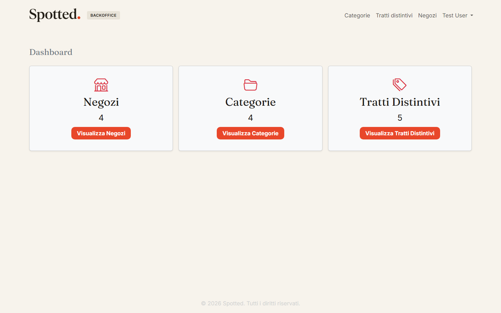
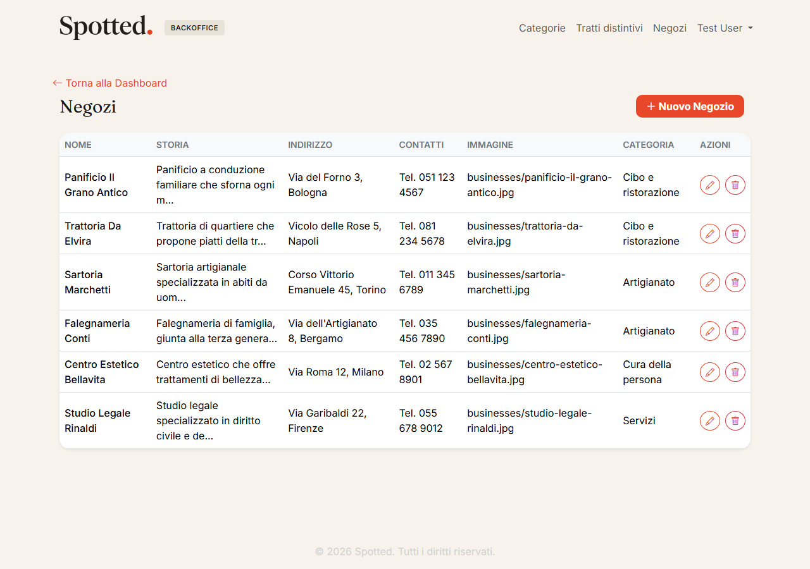
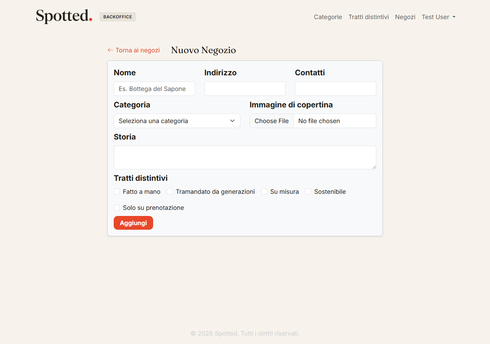
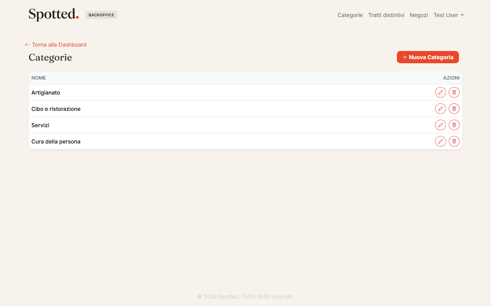
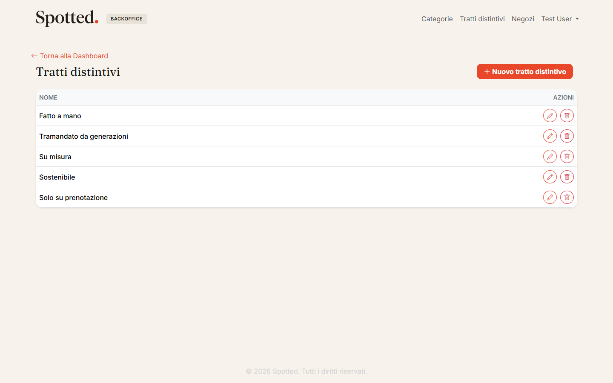

# Spotted

**Spotted** è un'applicazione web pensata per dare visibilità alle attività commerciali locali che hanno potenziale ma sono ancora poco conosciute — piccoli negozi, locali e artigiani che meritano di essere "scoperti" (spotted, appunto) e valorizzati, evidenziandone la storia, la categoria e le caratteristiche che li rendono unici.

Il progetto nasce come esame finale del corso Full Stack ed è composto da un backoffice Laravel per la gestione dei dati (attualmente sviluppato), a cui in futuro si affiancherà un sito pubblico in React consultabile dai visitatori.

## Scopo del progetto

L'obiettivo è permettere a un amministratore di:

- catalogare le attività commerciali da valorizzare (**Business**), con nome, storia/descrizione, indirizzo, contatti e immagine di copertina;
- organizzarle per **categoria** (es. ristorazione, abbigliamento, servizi);
- assegnare a ciascuna attività uno o più **tratti distintivi** (es. "pet friendly", "accessibile", "artigianale"), utili per far emergere ciò che le rende speciali e meritevoli di essere scoperte.

## Stack tecnologico

- **PHP 8.2+** / **Laravel 11**
- **Laravel Breeze** per l'autenticazione
- **Blade** per le viste del backoffice
- **Bootstrap 5** per lo stile
- **MySQL** come database
- **Vite** per la compilazione degli asset

## Funzionalità

- Autenticazione (login, registrazione, gestione profilo) tramite Laravel Breeze
- Dashboard con il conteggio di attività, categorie e tratti distintivi
- CRUD completo su **Business** (attività), con upload dell'immagine di copertina
- CRUD completo su **Category**
- CRUD completo su **DistinctiveTrait** (tratto distintivo)

## Screenshot

| Dashboard | Elenco negozi |
|---|---|
|  |  |

| Nuovo negozio | Categorie |
|---|---|
|  |  |

| Tratti distintivi |
|---|
|  |

## Modelli e relazioni

- `Business` **belongsTo** `Category` (relazione 1-N: ogni attività appartiene a una categoria)
- `Business` **belongsToMany** `DistinctiveTrait` (relazione N-N tramite tabella pivot)
- `Category` **hasMany** `Business`
- `DistinctiveTrait` **belongsToMany** `Business`

## Requisiti

- PHP >= 8.2
- Composer
- Node.js e [pnpm](https://pnpm.io/)
- MySQL

## Installazione

1. Clonare il repository e installare le dipendenze PHP:

   ```bash
   composer install
   ```

2. Copiare il file di ambiente e generare la chiave dell'applicazione:

   ```bash
   cp .env.example .env
   php artisan key:generate
   ```

3. Configurare la connessione al database MySQL nel file `.env`:

   ```
   DB_CONNECTION=mysql
   DB_HOST=127.0.0.1
   DB_PORT=3306
   DB_DATABASE=spotted
   DB_USERNAME=root
   DB_PASSWORD=
   ```

4. Eseguire le migration e popolare il database con i dati di esempio:

   ```bash
   php artisan migrate --seed
   ```

5. Installare le dipendenze JavaScript e compilare gli asset:

   ```bash
   pnpm install
   pnpm dev
   ```

6. Avviare il server di sviluppo:

   ```bash
   php artisan serve
   ```

L'applicazione sarà disponibile su `http://localhost:8000`. L'utente di test creato dal seeder è `test@example.com`.

## Test

I test automatici (feature e unit) girano su un vero database MySQL, non su SQLite:

```bash
php artisan test
```

## Struttura del progetto

- `app/Models` — modelli Eloquent (`Business`, `Category`, `DistinctiveTrait`)
- `app/Http/Controllers/Admin` — controller CRUD del backoffice
- `database/migrations` — schema del database
- `database/seeders` — dati di esempio
- `resources/views` — viste Blade
